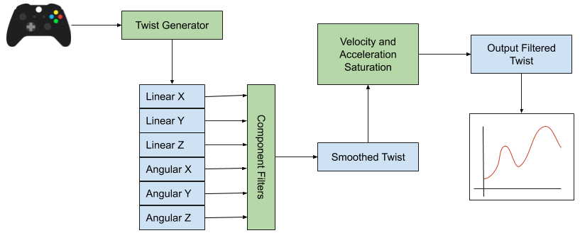
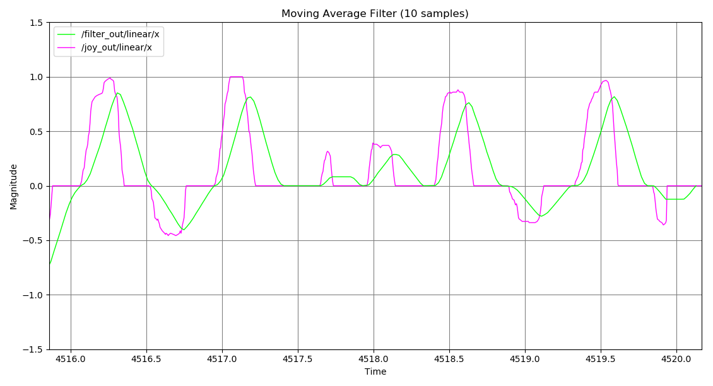
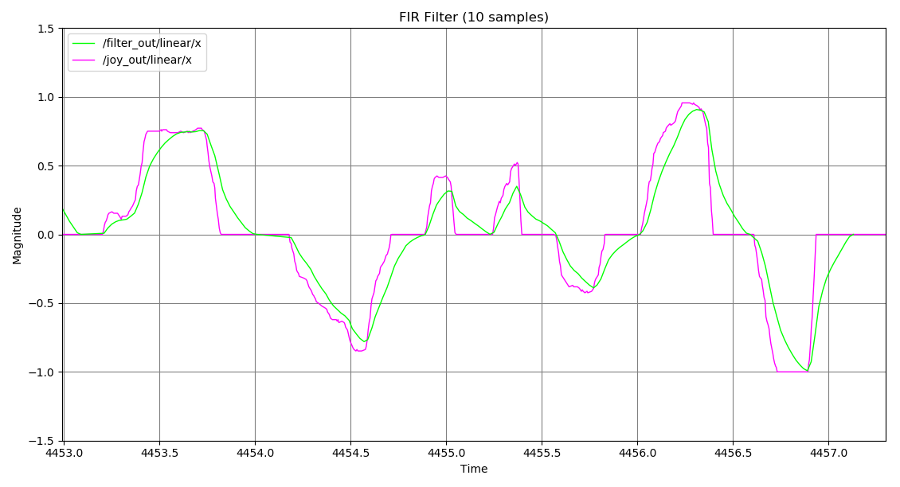
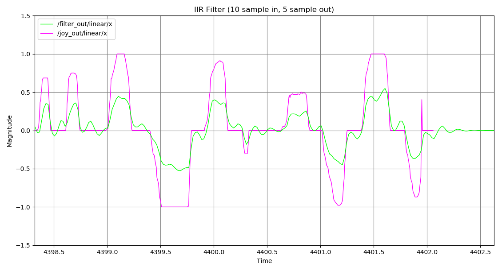
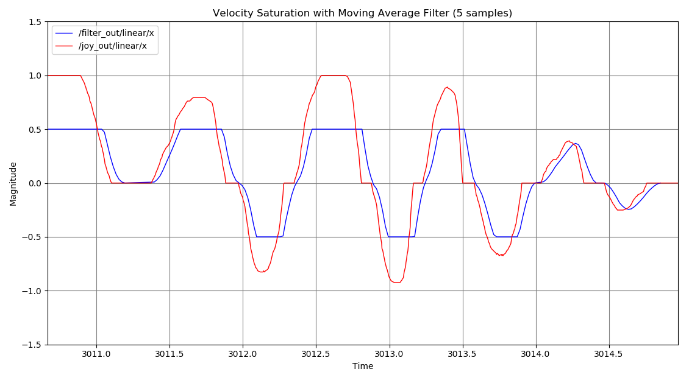
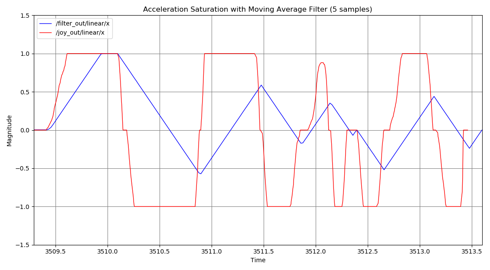
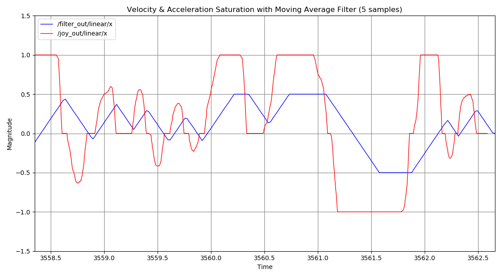

# Dynamic Twist Filter

This package is designed to work with the ROS 2 framework to filter twist messages via ROS topics. There are two layers of filtering: individual signal filtering and overall twist filtering. The user can dynamically adjust the overall twist filter parameters like maximum acceleration and maximum velocity for both the linear and angular components of the twist. There are three types of filters available: a moving average filter, a generic FIR filter, and an IIR filter.

This package is inspired by other twist filters, but unlike those that are application-specific or limited in functionality, this twist filter aims to be more generic and versatile while being maintained as a standalone package. Popular packages like [`cob_base_velocity_smoother`](https://github.com/ipa320/cob_control/tree/kinetic_dev/cob_base_velocity_smoother) and [`yocs_velocity_smoother`](https://github.com/yujinrobot/yujin_ocs/tree/devel/yocs_velocity_smoother) only focus on the linear x, y, and angular z components. Additionally, they don't offer component-level filtering or different filter configurations.

## Build Instructions

*NOTE: This package has been tested on Ubuntu 22.04 with ROS 2 Humble*

1. Clone the package into your ROS 2 workspace:
   ```bash
   git clone git@github.com:montrealrobotics/twist_filter.git src/twist_filter
   ```

2. Build the package:
   ```bash
   colcon build --packages-select twist_filter
   ```

3. Source your workspace:
   ```bash
   source install/setup.bash
   ```

## Run Instructions

To run the filters with their respective launch files:

```bash
ros2 launch twist_filter avg_filter.launch.py  # Moving average filter
ros2 launch twist_filter fir_filter.launch.py  # FIR filter
ros2 launch twist_filter iir_filter.launch.py  # IIR filter
```

**Launch File Arguments**

| Argument      | Description                                         | Type   | Default Value                        |
|---------------|-----------------------------------------------------|--------|--------------------------------------|
| input         | Filter input (topic of type `Twist`)               | String | 'filter_in'                          |
| output        | Filter output (topic of type `Twist`)              | String | 'filter_out'                         |
| filter_config | Path to the filter config file                     | String | '$(find twist_filter)/config/default_<FILTER_TYPE>.yaml' |
| use_repeater  | Indicator to use the repeater function             | Boolean| 'false'                              |

You can remap the input and output filter topics as well:

```bash
$ ros2 launch twist_filter avg_filter.launch.py input:=cmd_in output:=cmd_out
```

### Reconfiguration

Parameters can be reconfigured while the node is running, if you change the number of samples you should then update the weights so that the length matches the new sample number.

```bash
ros2 param set /fir_twist_filter num_samples 4
 ros2 param set /iir_twist_filter weights "'[0.5, 0.5, 0.5, 0.1]'"
```

*NOTE: Any zero or empty values will be ignored when updating. Depending on the parameter, however, leaving a value empty or zero may result in the filter failing to update.*

## How it Works

There are two layers of filtering. The first layer filters the individual components of the twist (linear and angular x, y, and z). Each component is filtered using one of the available filters (MA, FIR, or IIR). Once filtered, the components are reconstructed into a smoothed twist.



The second layer applies higher-level filtering. It looks at the magnitudes of the linear and angular velocities and accelerations of the twist and compares them to the specified thresholds (either from the motion profile or real-time updates via the configuration topic). If any magnitude exceeds the threshold, the entire twist is scaled down accordingly. This scaling ensures that the output twist adheres to the motion constraints.

*NOTE: The filter is designed for twists, and it has a special behavior for zero twists (all components are zero). When a zero twist is detected, it is published once, and subsequent zero twists are ignored. This behavior is useful to prevent the constant publication of empty twists and to make it more compatible with the `twist_mux` package. It is not recommended to use this filter if the twist is used as a heartbeat and requires continuous publication.*

## Samples

The following images show examples of how the filters behave when applied to twist data.

### Component-Level Filters

#### Moving Average Filter

Response from a 10-sample moving average filter. The input is shown in purple and the output in green.



#### FIR Filter

Response from a 10-sample FIR filter with the following weights: [0.35, 0.15, 0.1, 0.1, 0.05, 0.05, 0.05, 0.05, 0.05, 0.05]. The input is shown in purple and the output in green.



#### IIR Filter

Response from an IIR filter with a 10-sample input and the following weights: [0.35, 0.15, 0.1, 0.1, 0.05, 0.05, 0.05, 0.05, 0.05, 0.05], and a 5-sample feedback output with weights: [0.1, 0.2, 0.2, 0.25, 0.25]. The input is shown in purple and the output in green.



### Twist-Level Filters

These twist-level filters apply to the smoothed twists after filtering the components.

#### Velocity Limiting

Response to a velocity constraint at +/- 0.5 (original input was at +/- 1.0). The input is in red and the output in dark blue.



#### Acceleration Limiting

Response to an acceleration constraint of +/- 2.0 (original input had no limit). The input is in red and the output in dark blue.



#### Velocity and Acceleration Limiting

Response to both a velocity (+/- 0.5) and acceleration (+/- 2.0) constraint. The input is in red and the output in dark blue.

